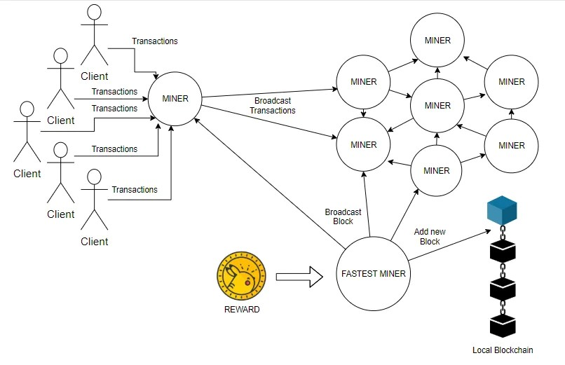
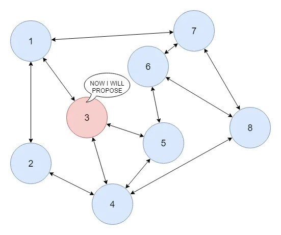
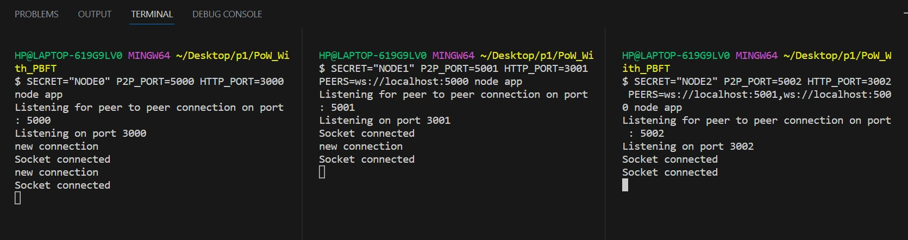

# Hybrid PoW + PBFT Blockchain Consensus

A consensus mechanism combining Proof of Work and Practical Byzantine Fault Tolerance, addressing the specific limitations of each on its own.

## Motivation

Proof of Work defends well against malicious actors and needs no fixed validator set, but it's computationally expensive, and in practice the mining power that secures it tends to concentrate in a small number of large pools — working against the decentralization it's meant to guarantee.

**Practical Byzantine Fault Tolerance** reaches fast, final agreement among a known set of validators, but depends on that set staying fixed, doesn't extend well to open networks, and has a hard mathematical floor: if the number of non-faulty nodes drops below 2f + 1 (where f is the number of faulty nodes), correct agreement can no longer be guaranteed.

This project designs a hybrid mechanism that uses PoW to fairly decide who proposes the next block — without needing a fixed validator list — then runs that proposal through a PBFT-style agreement round to reach fast finality, instead of waiting on further mining.

## Architecture
- **Network**: a working multi-node network built in Node.js, running across three concurrent nodes.
- **Client layer**: an HTTP/Express REST API handling client transactions.
- **Consensus layer**: a separate WebSocket-based peer-to-peer layer carrying consensus messages between nodes.
- **Cryptography**: implemented from scratch rather than imported — elliptic-curve key generation, digital signatures, and the transaction pool and wallet logic.
- **Consensus cycle**: the full PBFT message cycle implemented end to end — Pre-Prepare, Prepare, Commit, Round-Change.

All three nodes running and connecting to each other:

## What made this hard

Debugging a distributed system is a different kind of hard than debugging a single program. The bug is rarely in any one node's code — it lives in the timing between nodes, and finding it means tracing how messages actually move across the network, not just reading code in isolation.

## Result

By the time the three nodes were reliably reaching agreement, the hybrid design held up at the scale it was tested: PoW's centralization risk was addressed by not requiring a fixed validator set, and PBFT's fixed-validator ceiling was addressed by using PoW to determine block proposers fairly.

## Acknowledgments

An individual B.Tech Internship/Project component, supervised by Dr. Bharati Sinha, Assistant Professor, Department of Computer Engineering, National Institute of Technology, Kurukshetra (January–June 2023).
